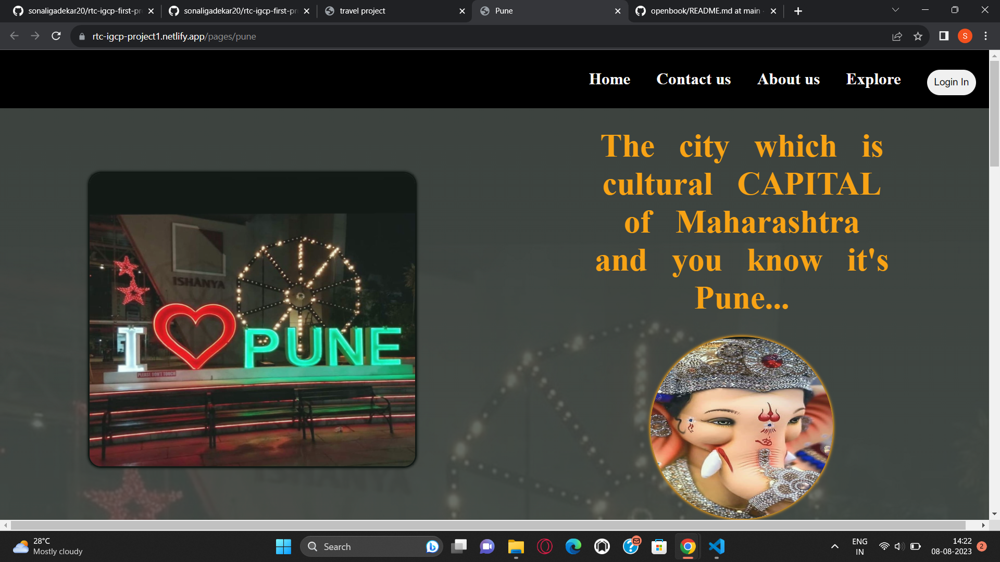
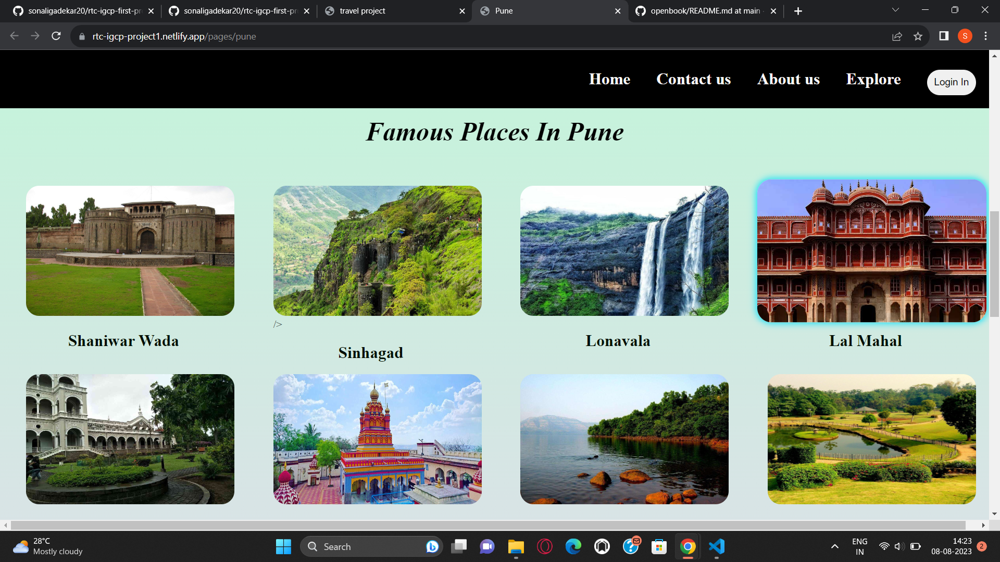

# Dream Destination
### Whether you're traveling solo, in the throes of explore, or with your family, there are many different ways to experience the City of Light. In partnership with Delta Vacations, we'll show you how you can use miles to do more.

## Famous Places In Maharashtra
.png)

**Pune city**

**Famous Places in Pune**

**Use Of Project**
This is Dream Destination I developed this project because it is helpful for tourism to search famous places in maharashtra for  visit.

**Description**
I developed this project using the **HTML** & **CSS**.
In this project, we added famous places **City-Wise** with location also we added hotels for staying with location.

**Real Life Use:**
Using this websites the tourism get to know about the specific place information.
 

## Contributors

Made with [contrib.rocks](https://contrib.rocks).